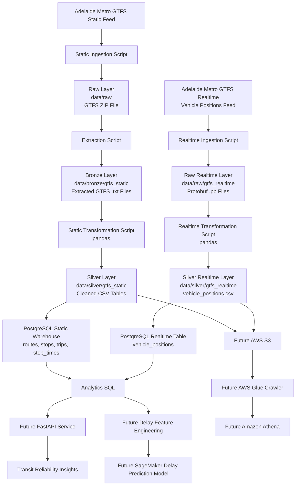
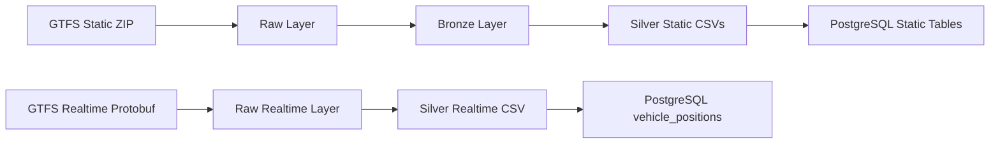

# Adelaide Transit Reliability & Delay Prediction Platform

## Problem Statement

Public transport delays affect commuters, businesses, students, and transport planners. However, raw transit data is difficult to use directly because it is fragmented across static schedule data, realtime vehicle updates, and future trip delay feeds.

This project solves that problem by building an end-to-end data engineering platform that collects, processes, stores, and prepares Adelaide Metro transit data for reliability analysis and delay prediction.

The platform is designed to help answer questions such as:

* Which routes have the most scheduled activity?
* Which stops are associated with high vehicle activity?
* Which vehicles are active in realtime?
* Which routes currently have live vehicle position records?
* Which routes are most frequently delayed? *(future stage)*
* Which stops are associated with recurring delays? *(future stage)*
* What time periods have the highest delay risk? *(future stage)*
* What is the expected delay for a route at a given time? *(future stage)*

At the current stage, the project supports static schedule analysis and realtime vehicle position ingestion. Delay calculation will be added later using GTFS Realtime trip updates and stop time updates.

---

## Solution

The project builds a data engineering pipeline using Python, SQL, PostgreSQL, and a medallion-style local data lake structure.

The current system ingests Adelaide Metro GTFS static data and GTFS Realtime vehicle position data, stores raw files locally, transforms selected files into cleaned silver-layer datasets, and loads structured data into PostgreSQL.

Future stages will extend the project with AWS S3, AWS Glue, Amazon Athena, Docker, FastAPI, orchestration, and a small machine learning component for delay prediction.

---

## Current Project Status

The project currently supports two local data pipelines:

1. Static GTFS schedule pipeline
2. Realtime GTFS vehicle positions pipeline

### Completed Components

* GTFS static feed ingestion
* Raw, bronze, and silver local data layers
* Static GTFS ZIP extraction
* Static GTFS transformation using pandas
* PostgreSQL schema for static GTFS tables
* Static GTFS PostgreSQL loading
* GTFS Realtime vehicle positions ingestion
* Raw protobuf storage for realtime vehicle positions
* Realtime vehicle positions silver transformation
* Realtime vehicle positions PostgreSQL loading
* Separate runner scripts for static and realtime pipelines
* Data source documentation
* Data model documentation
* Static schedule analytics SQL queries

### Current PostgreSQL Tables

Static GTFS warehouse tables:

* `routes`
* `stops`
* `trips`
* `stop_times`

Realtime GTFS table:

* `vehicle_positions`

---

## Architecture Diagram



---

## Local Data Pipeline Overview



---

## Tech Stack

Current stack:

* Python
* pandas
* requests
* GTFS Realtime protobuf bindings
* SQL
* PostgreSQL
* psycopg2
* python-dotenv
* Git/GitHub

Planned stack:

* Docker
* FastAPI
* AWS S3
* AWS Glue
* Amazon Athena
* Amazon SageMaker
* Orchestration tool such as Prefect or Airflow

---

## Project Structure

```text
adelaide-transit-analytics/
│
├── data/
│   ├── raw/
│   │   ├── gtfs_static/
│   │   └── gtfs_realtime/
│   │
│   ├── bronze/
│   │   └── gtfs_static/
│   │
│   └── silver/
│       ├── gtfs_static/
│       └── gtfs_realtime/
│
├── docs/
│   ├── data_sources.md
│   └── data_model.md
│
├── scripts/
│   ├── run_static_pipeline.py
│   └── run_realtime_vehicle_positions_pipeline.py
│
├── sql/
│   ├── ddl/
│   │   ├── create_gtfs_tables.sql
│   │   └── create_realtime_tables.sql
│   │
│   └── analytics/
│       └── gtfs_static_analysis.sql
│
├── src/
│   └── transit_pipeline/
│       ├── ingestion/
│       │   ├── fetch_gtfs_static.py
│       │   ├── extract_gtfs_static.py
│       │   └── fetch_gtfs_realtime.py
│       │
│       ├── transformation/
│       │   ├── transform_gtfs_static.py
│       │   └── transform_gtfs_realtime.py
│       │
│       └── loading/
│           ├── load_silver_to_postgres.py
│           └── load_realtime_to_postgres.py
│
├── .env.example
├── .gitignore
├── README.md
└── requirements.txt
```

---

## GTFS Static Pipeline

The static pipeline refreshes Adelaide Metro schedule and reference data.

It downloads the latest GTFS static ZIP file, extracts GTFS text files into the bronze layer, transforms selected files into cleaned silver-layer CSV tables, and loads the static warehouse tables in PostgreSQL.

### Static Pipeline Flow

```text
Adelaide Metro GTFS Static Feed
        ↓
Raw ZIP download
        ↓
Bronze extracted text files
        ↓
Silver cleaned CSV tables
        ↓
PostgreSQL static warehouse
```

### Static GTFS Files Used

| File             | Purpose                                                                     |
| ---------------- | --------------------------------------------------------------------------- |
| `routes.txt`     | Contains public transport route information.                                |
| `stops.txt`      | Contains stop names and geographic coordinates.                             |
| `trips.txt`      | Contains individual trip records linked to routes and services.             |
| `stop_times.txt` | Contains scheduled arrival and departure times for each trip-stop sequence. |

### Static Silver Tables

* `routes`
* `stops`
* `trips`
* `stop_times`

### Static PostgreSQL Tables

* `routes`
* `stops`
* `trips`
* `stop_times`

---

## GTFS Realtime Vehicle Positions Pipeline

The realtime vehicle positions pipeline captures a point-in-time snapshot of live Adelaide Metro vehicle locations.

It downloads the GTFS Realtime vehicle positions protobuf feed, saves the raw `.pb` file, parses the protobuf records, transforms them into a cleaned silver CSV, and appends the records into PostgreSQL.

### Realtime Pipeline Flow

```text
Adelaide Metro GTFS Realtime Vehicle Positions Feed
        ↓
Raw protobuf .pb file
        ↓
Parsed vehicle position records
        ↓
Silver vehicle_positions.csv
        ↓
PostgreSQL vehicle_positions table
```

### Realtime Fields Captured

The realtime vehicle positions pipeline currently captures:

* `entity_id`
* `trip_id`
* `route_id`
* `vehicle_id`
* `vehicle_label`
* `latitude`
* `longitude`
* `bearing`
* `speed`
* `vehicle_timestamp`
* `vehicle_datetime`
* `ingestion_file`

### Realtime PostgreSQL Table

* `vehicle_positions`

Each row in `vehicle_positions` represents one vehicle location snapshot at a point in time.

The table also includes:

* `position_id`: generated primary key
* `ingested_at`: database load timestamp

---

## Running the Pipelines Locally

Before running the pipelines, set the Python path:

```powershell
$env:PYTHONPATH="src"
```

### Run Static GTFS Pipeline

```powershell
python scripts\run_static_pipeline.py
```

This pipeline refreshes the static GTFS warehouse tables:

* `routes`
* `stops`
* `trips`
* `stop_times`

### Run Realtime Vehicle Positions Pipeline

```powershell
python scripts\run_realtime_vehicle_positions_pipeline.py
```

This pipeline appends a new realtime vehicle position snapshot into PostgreSQL.

### Run Only Static Transformation

```powershell
python src\transit_pipeline\transformation\transform_gtfs_static.py
```

### Run Only Realtime Transformation

```powershell
python src\transit_pipeline\transformation\transform_gtfs_realtime.py
```

---

## Environment Variables

Database credentials are stored in a local `.env` file.

Create a `.env` file using `.env.example` as a template.

Example:

```text
POSTGRES_HOST=localhost
POSTGRES_DB=adelaide_transit_db
POSTGRES_USER=postgres
POSTGRES_PASSWORD=your_password_here
POSTGRES_PORT=5432
```

The `.env` file should not be committed to GitHub.

---

## Current Analytical Questions Supported

The current warehouse can answer static schedule questions such as:

* How many routes, stops, trips, and stop time records were loaded?
* Which routes have the most scheduled trips?
* Which stops have the highest scheduled stop activity?
* Which trips have the highest number of stop sequences?
* Which routes generate the most scheduled stop events?

The realtime table can answer vehicle activity questions such as:

* How many live vehicle position records were collected?
* Which routes currently have active vehicle records?
* Which vehicles were moving or stopped at ingestion time?
* What was the latest reported position for each vehicle?
* When was each vehicle position recorded by the source feed?
* When was each vehicle position loaded into PostgreSQL?

---

## Current Scope

The current project supports:

* Static GTFS schedule ingestion
* Static GTFS transformation
* Static PostgreSQL warehouse loading
* Realtime vehicle position ingestion
* Realtime vehicle position transformation
* Realtime PostgreSQL append loading
* Basic analytics SQL

The project does not calculate delays yet.

Delay calculation requires GTFS Realtime trip updates and stop time updates, which will be added in a future stage.

---

## Planned Future Features

Future stages of the project will add:

* GTFS Realtime trip updates ingestion
* Stop time updates transformation
* Delay event table
* Route reliability metrics
* Stop-level delay metrics
* Data quality validation checks
* Dockerized pipeline environment
* FastAPI endpoints for reliability insights
* AWS S3 raw and silver data storage
* AWS Glue Data Catalog
* Amazon Athena query layer
* Orchestration with Prefect or Airflow
* SageMaker delay prediction model

---

## Documentation

* [Data Sources](docs/data_sources.md)
* [Data Model](docs/data_model.md)


