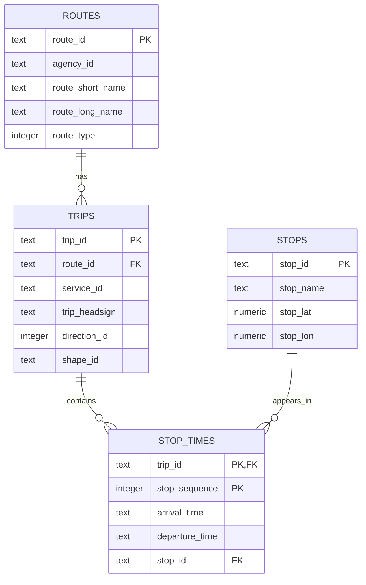

# Data Model

## Overview

This project currently models Adelaide Metri GTFS static schedule data in PostgreSQL

The warehouse contains four core GTFS static tables:

- routes
- stops
- trips
- stop_times

These tables represent the scheduled public transport network and provide the foundation for future route reliability monitoring and delay prediction.


## Table Relationships


## Relationship Explanation

### routes to trips

One route can have many trips.

Example:

A route such as `H30` may operate many scheduled trips throughout the day.

```text
routes.route_id → trips.route_id
```

This means `routes.route_id` is the parent key and `trips.route_id` is the foreign key.

Relationship type:

```text
One route → many trips
```

---

### trips to stop_times

One trip contains many stop time records.

Each stop time record represents when a specific trip is scheduled to arrive at or depart from a stop.

```text
trips.trip_id → stop_times.trip_id
```

This means `trips.trip_id` is the parent key and `stop_times.trip_id` is the foreign key.

Relationship type:

```text
One trip → many stop time records
```

---

### stops to stop_times

One stop can appear in many stop time records.

A single stop may be served by many different trips and routes.

```text
stops.stop_id → stop_times.stop_id
```

This means `stops.stop_id` is the parent key and `stop_times.stop_id` is the foreign key.

Relationship type:

```text
One stop → many stop time records
```

---

## Primary Keys

A primary key uniquely identifies each row in a table.

| Table        | Primary Key                | Reason                                             |
| ------------ | -------------------------- | -------------------------------------------------- |
| `routes`     | `route_id`                 | Uniquely identifies each route.                    |
| `stops`      | `stop_id`                  | Uniquely identifies each stop.                     |
| `trips`      | `trip_id`                  | Uniquely identifies each scheduled trip.           |
| `stop_times` | `trip_id`, `stop_sequence` | Uniquely identifies each stop event within a trip. |

---

## Why stop_times Uses a Composite Primary Key

The `stop_times` table does not have one single natural ID column.

A trip visits multiple stops, so `trip_id` alone is not unique.

A stop appears in many trips, so `stop_id` alone is not unique.

The combination of `trip_id` and `stop_sequence` uniquely identifies each scheduled stop event within a trip.

Example:

| trip_id | stop_sequence | stop_id | arrival_time |
| ------- | ------------: | ------- | ------------ |
| `T001`  |             1 | `S001`  | `08:00`      |
| `T001`  |             2 | `S002`  | `08:05`      |
| `T001`  |             3 | `S003`  | `08:10`      |

This prevents duplicate stop sequence records within the same trip.

---

## Current Use Cases

The current static GTFS warehouse supports:

* Route schedule analysis
* Stop activity analysis
* Trip-level stop sequence analysis
* Validation of GTFS static feed structure
* Foundation for future real-time delay comparison

---

## Future Model Extensions

Later stages of the project will add tables such as:

* `vehicle_positions`
* `trip_updates`
* `stop_time_updates`
* `delay_events`
* `route_reliability_metrics`

These future tables will allow the platform to compare scheduled times against real-time updates and calculate delay patterns.

---

## Documentation Links

Add this section to `README.md`:

```markdown
## Documentation

- [Data Sources](docs/data_sources.md)
- [Data Model](docs/data_model.md)
```
## Current Completed Pipeline

The current local pipeline supports the complete GTFS static batch ETL flow:

```text
Adelaide Metro GTFS Static Feed
        ↓
Python ingestion
        ↓
Raw layer: downloaded GTFS ZIP
        ↓
Bronze layer: extracted GTFS text files
        ↓
Silver layer: cleaned GTFS CSV tables
        ↓
PostgreSQL warehouse
        ↓
Analytics SQL queries
```

### Completed Components

* GTFS static feed ingestion
* Raw, bronze, and silver local data layers
* GTFS extraction automation
* Static GTFS transformation using pandas
* PostgreSQL schema for `routes`, `stops`, `trips`, and `stop_times`
* Python loader from silver CSVs to PostgreSQL
* Data model documentation
* Static schedule analytics SQL queries

### Current Warehouse Tables

* `routes`
* `stops`
* `trips`
* `stop_times`

### Current Scope

The current version supports schedule-based analysis only.

Delay analysis will be added later using GTFS Realtime data.
